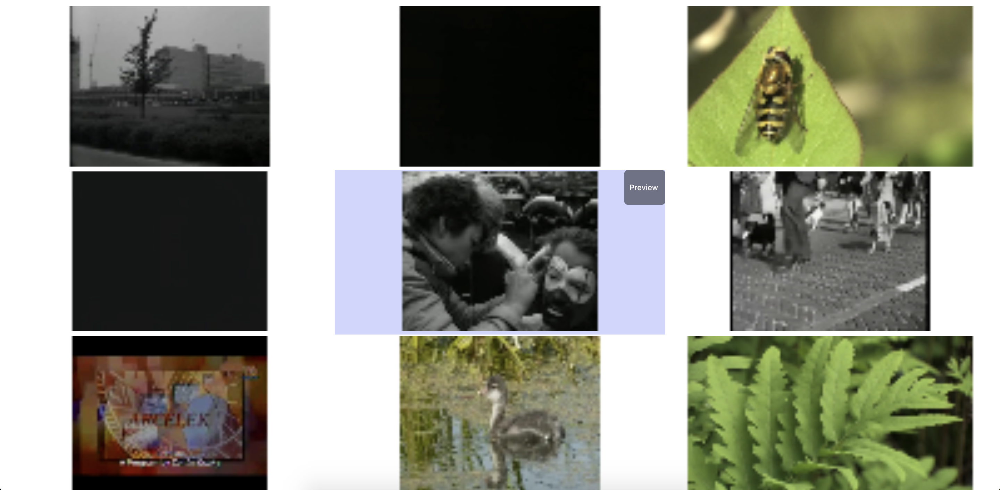
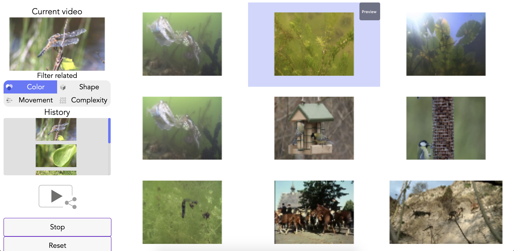
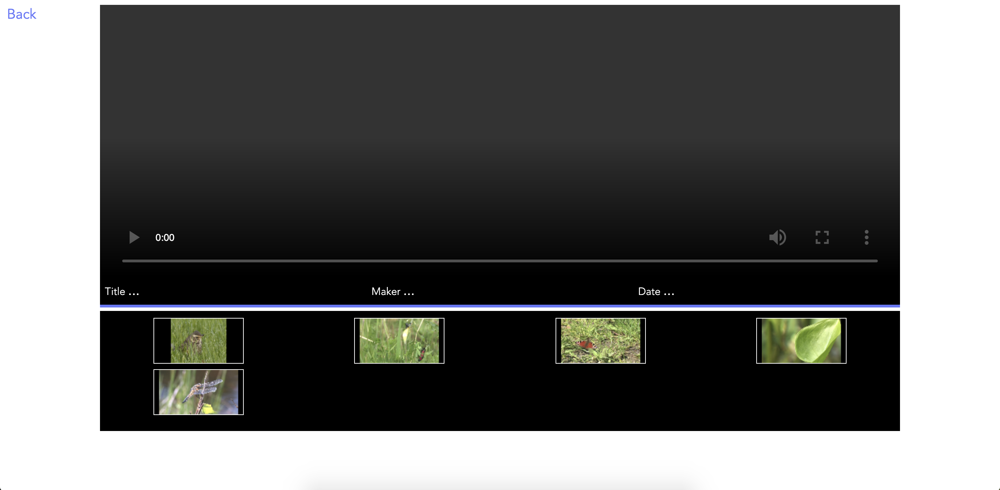
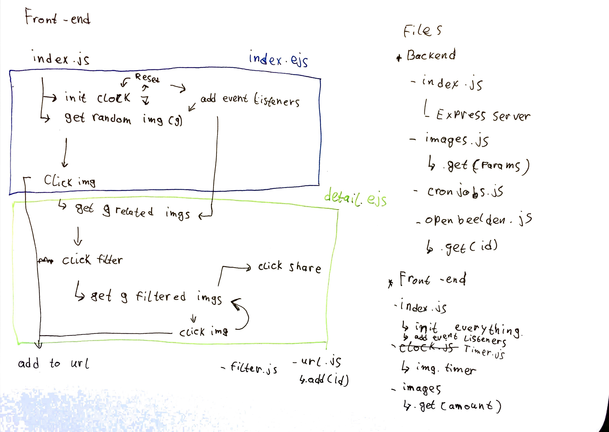
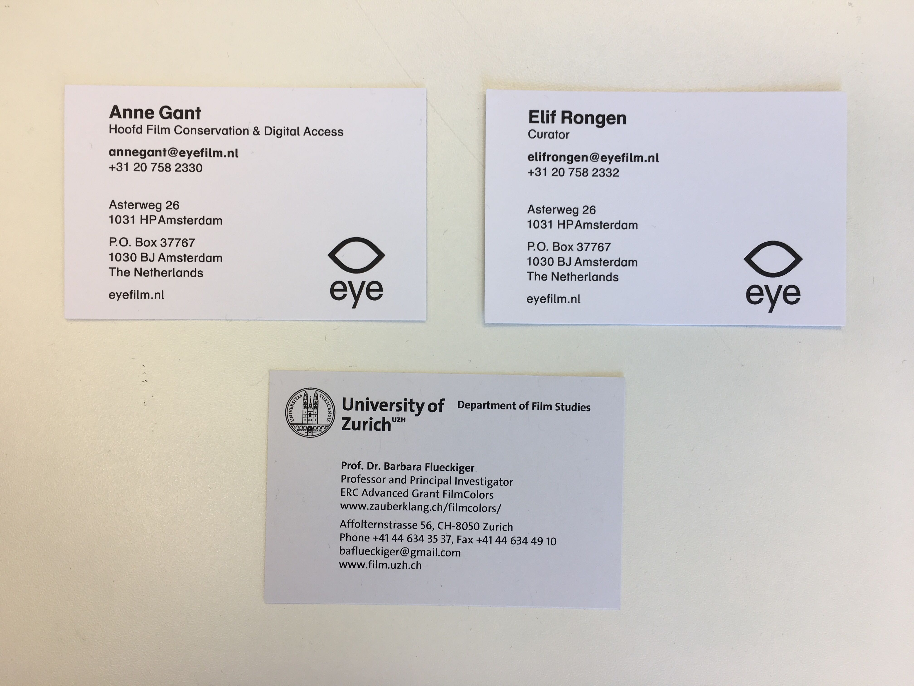

# Meesterproef
My documentation on the Semia project for the meesterproef which I did together with [Martijn](https://github.com/MartijnReeuwijk), [Tim](https://github.com/Timilof) and [Leonie](https://github.com/leoniesmits).  
During the project I was mostly responsible for the back-end of the application.

The repo can be found [here](https://github.com/MartijnReeuwijk/meesterproef-semia).

## Table of contents
* [The project](#the-project)
  * [The concept](#the-concept)
  * [The data](#the-data)
* [Learning goals](#learning-goals)
* [Weekly progress](#weekly-progress)
  * [Week 1](#week-1)
  * [Week 2](#week-2)
  * [Week 3](#week-3)
  * [Week 4](#week-4)
  * [Week 5](#week-5)
* [Reflection](#reflection)
  * [Web app from scratch](#web-app-from-scratch)
  * [Web design](#web-design)
  * [Performance matters - Perceived performance](#performance-matters---perceived-performance)
  * [Performance matters - Critical render path](#performance-matters---critical-render-path)
  * [Git & Github](#git-&-github)
* [Honorable mentions](#honorable-mentions)

## The project
Semia is a project started by researchers from the Eye film museum in amsterdam. It aims to make film material explorable by **not** using metadata such as author, title, genre e.t.c. But rather by using features of the film itself, consisting of: color, shape, movement and visual complexity.  
Our task was to create an app in which the film shots could be explored using the film features mentioned above.

### The concept
The concept was inspired by the Bladerunner 2049 movie. Sepcifically [this scene](https://youtu.be/04He1qcAgv8?t=48).  
The user gets to see 9 random images which are replaced with 9 new frames after 10 seconds. If the user sees an interesting frame, he/she can click on it and be presented 9 new frames which are in some way related to the previously clicked one. These 9 new frames are then replaced with new related frames after 10 seconds. When going through the related frames the user can also filter them on one specific feature (color, shape, movement, visual complexity).

| First screen | Second screen | End screen |
| --- | --- | --- |
|  |  | 

### The data
To achieve this we received data from [Nanne van Noord](https://nanne.github.io) who analyzed the films from [openbeelden](https://openbeelden.nl) using Artificial Intelligence, and created a dataset which contains the features of a particular shot.  

Using the thumbnails of the shots we constructed an array with the frame numbers to use and get random images from.

<details>
<summary>Shortened array of frame numbers</summary>

```json
[1000452,1000836,1000986,1001004,1001158,1001176,1001466,1001487,1001533,1001563,1001741,1001766,1001894,1001921]
```
</details>

When a user clicks a frame, we get the frame number and get the search results for that frame. We also got these search results from Nanne.  

<details>
<summary>This is what a search result looks like</summary>

```json
{
  "vid_id": "1001004",
  "shot_id": "1001004_107",
  "results": {
    "colour": ["1023301_107", "1001004_109", "1023301_109", "1023301_91", "1001004_91", "1001004_98", "1023301_98", "1001004_76", "1023301_76", "1001004_102", "1023301_102", "1001004_119", "1023301_119", "1001004_25", "1023301_25", "1023301_94", "1001004_94", "1001004_50", "1023301_50", "1023301_96", "1001004_96", "1023301_84", "1001004_84", "1023301_69", "1001004_69", "1023301_131", "1001004_131", "1001004_121", "1023301_121", "1023301_133", "1001004_133", "1001004_123", "1023301_123", "1001004_71", "1023301_71", "1001004_129", "1023301_129", "1023301_74", "1001004_74", "1001004_86", "1023301_86", "1023301_158", "1001004_158", "1023301_15", "1001004_15", "1001004_171", "1023301_171", "1001004_23", "1023301_23", "1023301_111"],
    "shape": ["1023301_107", "1023301_158", "1001004_158", "1023301_121", "1001004_121", "1023301_10", "1001004_10", "1001004_133", "1023301_133", "1001004_127", "1023301_127", "1001004_25", "1023301_25", "1001004_94", "1023301_94", "1023301_109", "1001004_109", "1023301_144", "1001004_144", "1001004_23", "1023301_23", "1001004_48", "1023301_48", "1023301_86", "1001004_86", "1001004_150", "1023301_150", "1001004_179", "1023301_179", "1001004_115", "1023301_115", "1001004_0", "1023301_0", "1001004_137", "1023301_137", "1001004_129", "1023301_129", "1001004_119", "1023301_119", "1023301_6", "1001004_6", "1023301_29", "1001004_29", "1001004_31", "1023301_31", "1023301_141", "1001004_141", "1001004_8", "1023301_8", "1001004_169"],
    "movement": ["1001004_107", "1033549_1", "1038860_0", "83433_8", "84215_8", "1055650_6", "1061450_7", "1033821_0", "1029787_2", "1023301_105", "1001004_105", "1024581_6", "84117_8", "745037_4", "165568_6", "1041781_0", "693622_14", "627868_22", "1023078_2", "1023682_2", "1027038_35", "953679_10", "1001004_23", "1023301_23", "84117_260", "1066864_12", "657685_2", "1042876_1", "1023078_6", "1001004_76", "1023301_76", "1068976_7", "1046758_2", "125768_7", "1070838_33", "84117_37", "1046796_3", "1027752_2", "745052_3", "815442_0", "82707_84", "750803_3", "1024210_25", "2778_13", "171577_16", "693622_46", "158497_5", "137699_0", "1035980_0", "1043318_2"],
    "clutter": ["1023301_107", "1039375_4", "162344_11", "652369_3", "98168_22", "1042876_1", "20540_8", "1001004_3", "1023301_3", "685502_15", "717673_0", "43244_11", "682058_11", "47315_14", "631177_25", "957054_11", "97944_11", "95682_9", "719197_0", "976376_53", "1128066_72", "62755_3", "687235_45", "83433_376", "54918_58", "654336_0", "815014_4", "802651_16", "688483_11", "14918_9", "127787_4", "678541_15", "1128121_7", "16586_6", "653991_16", "97996_12", "687259_30", "679539_8", "17655_21", "59894_11", "764167_6", "27585_12", "651069_21", "32425_1", "650224_9", "687361_3", "1127414_23", "1001563_2", "1023927_2", "43281_17"]
  }
}
```
</details>

Since the project is about video, we also offer to preview the video using a button that is displayed on top of a frame when hovering over it. This opens a popup which contains the metadata of the shot and a video player with the full video which contains the shot. The data for this popup comes from [openbeelden.nl](https://openbeelden.nl).

<details>
<summary>The data for the popup as received from the API</summary>

```json
{
  "OAI-PMH": {
    "responseDate": "2019-05-27T13:27:34Z",
    "request": {
      "_identifier": "oai:openimages.eu:1000452",
      "_metadataPrefix": "oai_dc",
      "_verb": "GetRecord",
      "__text": "https://openbeelden.nl/feeds/oai/?verb=GetRecord&amp;identifier=oai:openimages.eu:1000452&amp;metadataPrefix=oai_dc"
    },
    "GetRecord": {
      "record": {
        "header": {
          "identifier": "oai:openimages.eu:1000452",
          "datestamp": "2017-04-20T00:01:20Z",
          "setSpec": "vpro"
        },
        "metadata": {
          "dc": {
            "title": {
              "_xml:lang": "en",
              "__prefix": "dc",
              "__text": "Space pioneer Rick Tumlinson on colonizing space"
            },
            "creator": {
              "_xml:lang": "en",
              "__prefix": "dc",
              "__text": "VPRO"
            },
            "subject": [{
                "_xml:lang": "en",
                "__prefix": "dc",
                "__text": "Space"
              },
              {
                "_xml:lang": "en",
                "__prefix": "dc",
                "__text": "Space exploration"
              },
              {
                "_xml:lang": "en",
                "__prefix": "dc",
                "__text": "Planets"
              },
              {
                "_xml:lang": "en",
                "__prefix": "dc",
                "__text": "Colonization"
              },
              {
                "_xml:lang": "en",
                "__prefix": "dc",
                "__text": "Human settlements"
              },
              {
                "_xml:lang": "en",
                "__prefix": "dc",
                "__text": "Space technology"
              },
              {
                "_xml:lang": "en",
                "__prefix": "dc",
                "__text": "Space sciences"
              },
              {
                "_xml:lang": "en",
                "__prefix": "dc",
                "__text": "Asteroid mining"
              },
              {
                "_xml:lang": "en",
                "__prefix": "dc",
                "__text": "Dreamer"
              },
              {
                "_xml:lang": "en",
                "__prefix": "dc",
                "__text": "Future society"
              }
            ],
            "description": {
              "_xml:lang": "en",
              "__prefix": "dc",
              "__text": "Rick Tumlinson on colonizing space and our future work and life on other planets."
            },
            "publisher": [{
                "_xml:lang": "en",
                "__prefix": "dc",
                "__text": "VPRO"
              },
              {
                "__prefix": "dc",
                "__text": "https://www.openbeelden.nl/users/vpro"
              }
            ],
            "contributor": {
              "__prefix": "dc",
              "__text": "Rick Tumlinson"
            },
            "date": {
              "__prefix": "dc",
              "__text": "2016-10-02"
            },
            "type": {
              "__prefix": "dc",
              "__text": "Moving Image"
            },
            "format": [{
                "__prefix": "dc",
                "__text": "https://openbeelden.nl/files/10/00/1000467.1000456.Rick_Tumlinson.mp4"
              },
              {
                "__prefix": "dc",
                "__text": "https://openbeelden.nl/files/10/00/1000469.1000456.Rick_Tumlinson.mp4"
              },
              {
                "__prefix": "dc",
                "__text": "https://openbeelden.nl/files/10/00/1000456.Rick_Tumlinson.mp4"
              },
              {
                "__prefix": "dc",
                "__text": "https://openbeelden.nl/files/10/00/1000471.1000456.Rick_Tumlinson.webm"
              },
              {
                "__prefix": "dc",
                "__text": "https://openbeelden.nl/files/10/00/1000473.1000456.Rick_Tumlinson.ogv"
              },
              {
                "__prefix": "dc",
                "__text": "https://openbeelden.nl/files/10/00/1000475.1000456.Rick_Tumlinson.ogv"
              },
              {
                "__prefix": "dc",
                "__text": "https://openbeelden.nl/files/10/00/1000490.1000456.Rick_Tumlinson.m3u8"
              },
              {
                "__prefix": "dc",
                "__text": "https://openbeelden.nl/images/1000502/Space_pioneer_Rick_Tumlinson_on_colonizing_space_%2837_56%29.png"
              }
            ],
            "identifier": {
              "__prefix": "dc"
            },
            "source": {
              "_xml:lang": "en",
              "__prefix": "dc"
            },
            "relation": {
              "_xml:lang": "en",
              "__prefix": "dc"
            },
            "mediator": {
              "_xml:lang": "en",
              "__prefix": "dc"
            },
            "language": {
              "__prefix": "dc",
              "__text": "en"
            },
            "coverage": {
              "_xml:lang": "en",
              "__prefix": "dc",
              "__text": "Auston, US"
            },
            "rights": {
              "__prefix": "dc",
              "__text": "https://creativecommons.org/licenses/by-sa/3.0/nl/"
            },
            "_xmlns:xsi": "http://www.w3.org/2001/XMLSchema-instance",
            "_xmlns:dc": "http://purl.org/dc/elements/1.1/",
            "_xmlns:oai_dc": "http://www.openarchives.org/OAI/2.0/oai_dc/",
            "_xsi:schemaLocation": "http://www.openarchives.org/OAI/2.0/oai_dc/ http://www.openarchives.org/OAI/2.0/oai_dc.xsd",
            "__prefix": "oai_dc"
          }
        }
      }
    },
    "_xmlns:xsi": "http://www.w3.org/2001/XMLSchema-instance",
    "_xmlns": "http://www.openarchives.org/OAI/2.0/",
    "_xsi:schemaLocation": "http://www.openarchives.org/OAI/2.0/ http://www.openarchives.org/OAI/2.0/OAI-PMH.xsd"
  }
}
```
</details>

## Learning goals

| Course | Goal | Description |
| --- | --- | --- |
| **Web app from scratch** | App structure and code quality. | Making sure the code is clean, readable and maintainable by enforcing a code style and structured modules. |
| **Web design** | User test | Performing a user test and using the test results to improve the product. |
| **Performance matters** | Perceived performance | Making sure the user sees something instantly so he/she can use the application |
| **Performance matters** | Critical render path | Optimizing file sizes and delivery for a faster application |

And a last learning goal that is not related to the previous courses:

| Tool | Goal | Description |
| --- | --- | --- |
| **Git & Github** | Working in a team using Git & Github | Learning to work in a team on a project using Git & Github. Managing branches, issues and pull requests. |

## Weekly progress
My progress on a per week basis.

### Week 1
In the first week we got briefed on the project and were shown a few interfaces that had been made before, and were also tested with a few users. We were also told what the product owners were expecting us to do. Which was to create an experimental user interface to explore the dataset.  
After we came up with a concept Martijn and I started working on setting up the back-end.

### Week 2
In the second week we had a meeting with Nanne, who explained the data to us and showed how shots were linked. This was very interesting, because he showed some examples where some frames were visibly related, but others weren't but were related in another way (mostly movement).  
We also got very positive feedback from the product owners.

At the end of the week, the back-end of the project began to grow fairly quickly and it was starting to get messy, so I decided it was time to [enforce a code style](https://github.com/MartijnReeuwijk/meesterproef-semia/pull/16) and [restructure the back-end and front-end in modules](https://github.com/MartijnReeuwijk/meesterproef-semia/pull/21). The modules also made it easier to collaborate, since it avoids some merge conflicts.

### Week 3
In week 3 I implemented the back-end functionality to turn a search url into a custom url for sharing because the search url's can get very long, depending on the amount of frames a user clicks on. Due to time constrains this feature didn't get implemented in the front-end.

We also had a feedback session with the product owners and Christian Olesen, who also works on the project at Eye and the UvA. I wasn't able to attend to this meeting because I had an interview for an internship. But Christian proposed to do a test with a few users the following week.

### week 4
In this week I created the basic functionality for the rotating related images on the 'second page'. I also added some functionality to the timer for it to [work correctly](https://github.com/MartijnReeuwijk/meesterproef-semia/pull/62).

We also had a user test session at the Eye collectioncentre. We tested with 5 users. 4 of them work at eye. The 5th was a professor from Zürich. One of the users from Eye was not the target audience because she found the application useless, but it was still interesting to see. The professor was really positive and had some great feedback which was great.  
Afterwards we created a [project board on github](https://github.com/MartijnReeuwijk/meesterproef-semia/projects/2) containing all the to do's we got from the tests. One of which was the ability to go back in the [history of clicked frames](https://github.com/MartijnReeuwijk/meesterproef-semia/pull/77).

### Week 5
In week 5 I started writing the documentation which you are reading now. We also started to work on the design rational.

## Reflection
This is my reflection on my [learning goals](#learning-goals).

### Web app from scratch
> Making sure the code is clean, readable and maintainable by enforcing a code style and structured modules.

In week 2 the codebase started to get bigger and messier. So I decided it was time to enforce a code style. I did this by adding a [build script](https://github.com/MartijnReeuwijk/meesterproef-semia/blob/2e48fd7e1f4181b215dd535674b4c067c8ba4c91/package.json#L9) which uses [standardjs](https://standardjs.com). The script fixes all minor problems (semicolons, indentation e.t.c.) and throws an error if there are bigger problems e.g. unused variables.

The next step was to refactor basically the *whole* codebase and split front-end and back-end functionality up into modules.  
I first sketched the functionality to better understand what was going on in the app at that time and what modules I could create.

<details>
<summary>Sketch of the project modules</summary>


</details>

Afterwards I started refactoring. You can see what I did in [this pull request](https://github.com/MartijnReeuwijk/meesterproef-semia/pull/21/files).

To structure the project event better the project should have used something like sass for the css, because right there are a lot of css files.  
I should also have kept an eye on the js files for the front-end, because there are a few files that I feel could have been an es6 module.

<details>
<summary>Code layout of the project</summary>

```
root
|
| - partials/
|   |
|   | - cronJobs.js
|   | - data.js
|   | - db.js
|   | - openbeelden.js
|   | - setupdb.js
|
| - static/
|   |
|   | - css/
|       | - attribute.css
|       | - clock.css
|       | - footer.css
|       | - keyframes.css
|       | - master.css
|       | - nav.css
|       | - overlay.css
|       | - share.css
|   | - images/
|       | - icons/
|       | - logo/
|       | - socials/
|       | - thumbnails/
|   | - js/
|       | - partials/
|       | - detail.js
|       | - filter.js
|       | - history.js
|       | - index.js
|       | - intro.js
|       | - manifest.json
|       | - share.js
|   | - semia_data/
|       | - SEMIA_seach_results.json
|   | - array.json
|   | - sw-register.js
|   | - worker.js
|
| - views/
|   |
|   | - partials/
|   | - detail.ejs
|   | - error.ejs
|   | - index.ejs
|   | - offline.ejs
|   | - search.ejs
|
| - .env
| - config.json
| - index.js
```

</details>


### Web design
> Performing a user test and using the test results to improve the product.

In week 4 we had a testing session at the Eye collection centre with 5 users. We tested with 2 people who were familiar with the semia project, 2 people who worked there and one professor from Zürich.  
It was great to do these tests because as people who work on the project we tend to miss a lot of UX problems which were pointed out by the testers.  
It was also really interesting to talk with Prof. Dr. Barbara Flueckiger from the university of Zürich. She knew quite a lot about the subject, because she was working on similar projects.

<details>
<summary>Business cards</summary>


</details>

### Performance matters - Perceived performance
> Making sure the user sees something instantly so he/she can use the application.

The idea here was to load the lowest resolution thumbnail first to show the user the 9 frames as quick as possible, and then load the highest resolution ones.  
I didn't get around to doing this since I was pretty busy building the back-end. It also didn't have a high priority since the highest resolution thumbnail 128x64px and 13kb. The app also gets a 100% performance score from chrome's audit. So we would rather focus on adding features.

### Performance matters - Critical render path
> Optimizing file sizes and delivery for a faster application.

The idea here was to add a npm build script to minify the js and css files and compress them using gzip or brotli. I did create the [build scripts](https://github.com/MartijnReeuwijk/meesterproef-semia/blob/e40f816edd2977f0f8548c7929fbf624841a800a/package.json#L9-L12) required.  
Since the filesizes are really small (often 1 kb or less), we didn't see any benefit in doing this. Also because the app already got a 100% performance score.

### Git & Github
> Learning to work in a team on a project using Git & Github. Managing branches, issues and pull requests.

This was an interesting journey for me as it was the only learning goal that I haven't done before.  
At the [weekly mingles](https://github.com/jeroentvb/weekly-nerd-1819#weekly-mingles) we got some information on how companies worked with git and branches. Most of them had some branch setup of the following:

| Branch name | Description |
| --- | --- |
| Master | Most important branch. Only suited for finished code. |
| Staging | New version of the code. Needs to be tested to make sure it doesn't contain any bugs or glitches |
| Development | If a feature is finished it gets merged into development, which later gets merged into staging if all new features are complete. |
| Feature branch | A branch built on development where a specific feature is being developed |

Since we were working on a relatively small project I opted to go for the following setup:
* [master](https://github.com/MartijnReeuwijk/meesterproef-semia/tree/master)
* [dev](https://github.com/MartijnReeuwijk/meesterproef-semia/tree/dev)
* feature branch

I also asked Martijn to make the `dev` branch a protected branch, meaning at least one code review is required to merge a branch into dev. This way the code is checked by others and mistakes can be pointed out before something goes south.  

And of course I ran into a few merge conflicts. But they weren't hard to solve. The modular structure of the project defenitly helped with that.

## Honorable mentions
* [Martijn](https://github.com/MartijnReeuwijk), [Tim](https://github.com/Timilof) and [Leonie](https://github.com/leoniesmits) for the collaboration on this project.
* [Bas Pieren](https://github.com/baspieren) for the inspiration for this document
* Christian Olesen for arranging the tests
* Irene, Anne, Elif, Barbara and Christian for testing
